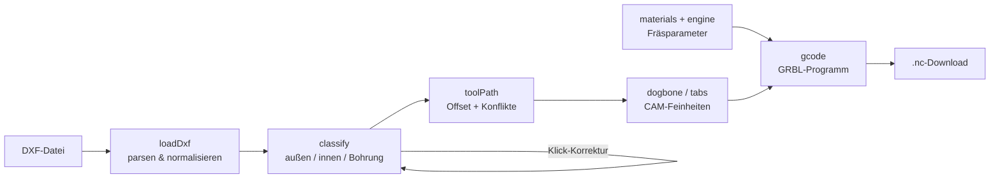

# camly — Funktionsumfang, Techstack & Architektur

> **Kurzfassung:** camly ist ein reines Browser-Tool, das eine 2D-Zeichnung (DXF)
> in fräsfertigen GRBL-G-Code übersetzt — gebaut für die Maslow 4, nutzbar mit
> jeder GRBL-CNC. Es gibt keinen Server und keinen Cloud-Dienst: Datei rein,
> `.nc`-Datei raus, alles läuft lokal im Browser. Als Extra begründet Claude
> (mit eigenem API-Key) die vorgeschlagenen Fräsparameter.

---

## 1. Was macht camly? (Funktionsumfang)

Der komplette Workflow ist als **6-Schritte-Assistent** aufgebaut. Stand heute
(„Welle 1") sind alle sechs Schritte funktionsfähig: **DXF rein, G-Code raus.**

### Schritt 1 — Upload
- DXF-Datei per Drag & Drop oder Dateiauswahl laden.
- Unterstützte DXF-Elemente: **Linien, Polylinien, Kreise, Kreisbögen**
  (`LINE`, `LWPOLYLINE`, `POLYLINE`, `CIRCLE`, `ARC`).
- Nicht unterstützte Elementtypen verschwinden nicht still, sondern werden
  dem Nutzer als „noch nicht gezeichnet" gemeldet.

### Schritt 2 — Prüfen
- Canvas-Vorschau der Zeichnung mit automatischer Einpassung.
- Setup-Eingaben: **Fräser-Durchmesser, Materialstärke, Rand um die Teile.**
- Job-Übersicht: Bauteilmaße, benötigte Plattengröße, **Passt-auf-die-Maslow-Check**
  (Arbeitsfläche 2440 × 1220 mm, beide Orientierungen), Anzahl Bohrungen,
  Schnittweglänge.

### Schritt 3 — Klassifizieren
- **Automatische Kontur-Klassifikation** in vier Rollen:
  - **Außenschnitt** (das Teil wird außen herum ausgeschnitten)
  - **Ausschnitt** (Loch/Fenster im Teil)
  - **Bohrung** (Kreis, standardmäßig bis Ø 30 mm)
  - **offen** (nicht geschlossene Kontur, wird beim Export übersprungen)
- Die Heuristik arbeitet über die **Verschachtelungstiefe**: gerade Tiefe =
  Material (außen), ungerade Tiefe = Loch (innen).
- **Klick-Korrektur:** Ein Klick auf eine Kontur wechselt ihre Rolle durch
  (Außenschnitt → Ausschnitt → Bohrung → offen). Der Hit-Test trifft dabei
  bevorzugt die innerste geschlossene Kontur unter dem Mauszeiger.
- **Fräser-Zentrumpfad live in der Vorschau** (gestrichelt): außen liegende
  Konturen werden um den Fräserradius nach außen versetzt, innen liegende nach
  innen.
- **Konflikt-Erkennung:** Bohrungen oder Ausschnitte, die kleiner sind als der
  Fräser, werden markiert und mit Handlungsempfehlung gemeldet (kleinerer
  Fräser, Tasche fräsen, vorbohren).

### Schritt 4 — Parameter (mit KI-Begründung)
- **Parameter-Engine** für die Maslow 4 mit Makita RT0701C Oberfräse.
- Eingaben: Material, Schneidenzahl (1 oder 2), Fräser-Ø, Materialstärke.
- Hinterlegte Materialien: **Birke Multiplex, Pappel-Sperrholz, MDF,
  Fichte/Kiefer massiv** — jeweils mit Chipload-Bereichen nach Fräser-Ø und
  Zustellfaktor.
- Berechnete Ausgaben: **Drehzahl + Makita-Stellrad (1–6), Vorschub,
  Eintauchvorschub, Zustellung pro Durchgang, Anzahl Durchgänge, effektive
  Spanungsdicke.**
- Kern ist die Chipload-Formel `Vorschub = Drehzahl × Schneidenzahl ×
  Spanungsdicke`, gedeckelt durch die Maschinengrenzen der Maslow 4
  (max. 1200 mm/min Vorschub, 400 mm/min Eintauchen, 5 mm Zustellung).
- **Warnungen** bei kritischen Kombinationen: Spanungsdicke unter Minimum
  (Brandgefahr), zu großer Fräser (> Ø 8 mm, Abdrängung), zu viele Schneiden.
- **Begründung immer inklusive:** Eine regelbasierte Erklärung der Werte läuft
  lokal und ohne jede Anmeldung. Optional prüft und begründet **Claude**
  (Modell `claude-opus-4-8`) die Werte — direkt aus dem Browser mit dem
  API-Key des Nutzers. Der Key bleibt im localStorage des Browsers und geht
  ausschließlich an `api.anthropic.com`, nie an einen camly-Server.

### Schritt 5 — CAM
- **Haltestege (Tabs):** kleine Materialbrücken, die das Teil beim letzten
  Durchgang in der Platte halten. Breite, Höhe und Aktivierung einstellbar;
  Anzahl und Verteilung werden automatisch aus dem Konturumfang berechnet
  (Standard: alle ~250 mm, 2 bis 10 Stege, keine Stege unter 120 mm Umfang).
  Vorschau als grüne Marker auf der Kontur.
- **Dogbones:** an konvexen Innenecken von Ausschnitten lässt der runde Fräser
  eine Rundung stehen — der Dogbone fährt entlang der Winkelhalbierenden in die
  Ecke und räumt sie frei, damit eckige Teile in den Ausschnitt passen.
  Zuschaltbar, mit Vorschau.

### Schritt 6 — Export
- **GRBL-G-Code-Generator** mit sinnvoller Bearbeitungsreihenfolge:
  **Bohrungen zuerst, dann Ausschnitte, Außenschnitte zuletzt** (das Teil löst
  sich erst am Ende aus der Platte).
- **Mehrfach-Durchgänge** in Z bis auf Materialstärke plus 0,2 mm Durchfräsen
  ins Opferbrett; Haltestege wirken nur in den unteren Durchgängen
  (Fräser hebt in der Steg-Region an und senkt danach wieder ab).
- Nullpunkt-Konvention: **XY wie im DXF, Z0 auf der Materialoberseite**,
  Zustellung ins Negative.
- Statistik vor dem Download: Konturen, Durchgänge, Stege, Fräsweg,
  **geschätzte Fräsdauer**, Zeilenzahl — plus G-Code-Vorschau.
- **Download als `.nc`-Datei**, benannt nach der DXF-Datei.

### Was (noch) nicht geht
- **Bogen-Offset:** Kreisbögen werden gezeichnet und als Pfad übernommen, aber
  noch nicht um den Fräserradius versetzt.
- **Gravur offener Konturen:** offene Konturen werden beim Export übersprungen
  (mit Hinweis), eine Gravur-Strategie kommt später.
- **Selbstschnitt-Auflösung beim Polygon-Versatz:** Der Offset ist bewusst
  einfach gehalten (Segment-Versatz + Ecken-Schnitt); entartete Konturen werden
  als Konflikt gemeldet statt falsch gefräst.
- **Taschen-Fräsen** (Ausräumen von Flächen) gibt es noch nicht.

---

## 2. Techstack

| Ebene | Technologie | Rolle |
|---|---|---|
| Sprache | **TypeScript** (~6.0) | gesamter Code, strikt typisiert |
| UI-Framework | **Svelte 5** | Ein-Seiten-App, reaktiver 6-Schritte-Assistent |
| Build | **Vite 8** | Dev-Server, Bundling |
| PWA | **vite-plugin-pwa** | installierbar, Auto-Update per Service-Worker |
| DXF-Import | **dxf-parser** | liest das DXF-Rohformat |
| KI | **@anthropic-ai/sdk** | Claude-Aufruf direkt aus dem Browser (`dangerouslyAllowBrowser`, eigener Key) |
| Rendering | **Canvas 2D API** | Zeichnungs- und Pfad-Vorschau, ohne Bibliothek |
| Qualität | **svelte-check + tsc** | `npm run check`; dazu `scripts/smoketest.ts` als Konsolen-Smoketest |

**Bewusste Entscheidungen:**

- **Kein Backend.** camly ist statisches Hosting + Browser. Die einzige
  externe Verbindung ist der optionale Claude-Aufruf mit dem Key des Nutzers.
- **Nur 2 Runtime-Abhängigkeiten** (`dxf-parser`, `@anthropic-ai/sdk`) —
  Geometrie, CAM und G-Code sind komplett selbst geschrieben.
- **Alle Einheiten metrisch:** mm, mm/min, U/min.

---

## 3. Software-Architektur

### 3.1 Grundprinzip: Framework-freier Kern, dünne UI-Schale

Das wichtigste Architekturmerkmal: **Der gesamte CAM-Kern in `src/lib/` ist
framework-frei.** Kein Modul dort importiert Svelte oder greift auf das DOM zu
(einzige Ausnahmen: `render/` braucht ein Canvas-Element, `params/explain.ts`
nutzt localStorage). Dadurch ist der Kern ohne Browser testbar
(`scripts/smoketest.ts` läuft direkt in Node) und wiederverwendbar.

`App.svelte` ist die einzige Komponente: sie hält den Zustand des Assistenten
(aktueller Schritt, Setup-Werte, Rollen) und verdrahtet die Kern-Module über
Sveltes Reaktivität — ändert der Nutzer z. B. den Fräser-Ø, rechnen Pfade,
Parameter und G-Code automatisch neu.

### 3.2 Modulstruktur

```
src/
├── App.svelte              UI: 6-Schritte-Assistent, Zustand, Reaktivität
├── main.ts                 Einstiegspunkt (mountet App)
├── app.css                 Styling
└── lib/                    framework-freier Kern
    ├── dxf/
    │   ├── loadDxf.ts      DXF-Text → normalisierte Entity-Liste + BBox
    │   └── types.ts        zentrale Geometrie-Typen (Pt, Entity, BBox, DxfDoc)
    ├── analyze/
    │   └── jobInfo.ts      Plattenmaß, Maslow-Fit, Bohrungszahl, Schnittweg
    ├── cam/
    │   ├── classify.ts     Rollen-Heuristik (außen/innen/Bohrung/offen)
    │   ├── toolPath.ts     Fräser-Zentrumpfad (Offset) + Konflikt-Erkennung
    │   ├── dogbone.ts      Dogbones an konvexen Ausschnitt-Ecken
    │   ├── tabs.ts         Haltestege als Bogenlängen-Regionen, Z-Profile
    │   └── gcode.ts        GRBL-Programm + Statistik/Zeitschätzung
    ├── params/
    │   ├── materials.ts    Lookup-Tabelle: Materialien, Makita-Stufen, Maslow-Grenzen
    │   ├── engine.ts       Chipload-Rechnung → Parameter-Vorschlag + Warnungen
    │   └── explain.ts      lokale Begründung / Claude-Anbindung (Browser-SDK)
    └── render/
        ├── renderDxf.ts    Canvas-Zeichnung (Rollenfarben, Pfade, Marker)
        ├── viewTransform.ts Welt↔Canvas-Transformation (Y-Achse gespiegelt)
        └── hitTest.ts      Klick → innerste getroffene Kontur
```

### 3.3 Datenfluss (Pipeline)



Jede Stufe ist eine **reine Funktion über einfachen Datenstrukturen**:

1. **`parseDxf(text)`** → `DxfDoc` — normalisiert den DXF-Wildwuchs auf vier
   Entity-Typen (`line`, `polyline`, `circle`, `arc`) plus Bounding-Box;
   unbekannte Typen landen sichtbar in `skipped`.
2. **`classifyDoc(entities)`** → `Role[]` — Verschachtelungstiefe über mehrere
   Stützpunkte pro Kontur (robust gegen Punkte, die zufällig in einer tieferen
   Kontur liegen). Der Nutzer kann jede Rolle per Klick überstimmen.
3. **`buildToolPaths(entities, roles, toolDiameter)`** → Zentrumpfade.
   Kreise: Radius ± Fräserradius. Polylinien: Segment-Normalen-Versatz mit
   Ecken-Schnitt, Orientierung wird über die vorzeichenbehaftete Fläche
   normalisiert. Nicht fräsbare Konturen bekommen ein `conflict`-Flag mit
   Klartext-Begründung — sie fallen nicht still weg.
4. **`insertDogbones(...)`** / **`computeTabs(...)`** — arbeiten auf den
   fertigen Zentrumpfaden. Tabs sind als Bogenlängen-Intervalle modelliert und
   werden erst bei der G-Code-Erzeugung in Z-Bewegungen übersetzt.
5. **`suggestParams(input)`** → Parameter-Vorschlag aus der Lookup-Tabelle
   (`materials.ts` ist reine Daten-Datei: Chipload-Bereiche, Makita-Stellrad-
   Stufen, Maslow-Grenzwerte — Erfahrungswerte, bewusst konservativ, weil die
   Maslow als Seilroboter weniger steif ist als eine Portalfräse).
6. **`generateGcode(job)`** → G-Code-Text + Statistik. Sortiert nach Rolle
   (Bohrung → Ausschnitt → Außenschnitt), erzeugt Z-Durchgänge, hebt in
   Tab-Regionen an, schätzt die Fräsdauer aus Weglängen und Vorschüben.

### 3.4 Architektur-Eigenschaften, die man kennen sollte

- **Heuristik + Mensch:** Die Klassifikation ist bewusst ein *Vorschlag*.
  Statt eine perfekte Automatik anzustreben, gibt es die Ein-Klick-Korrektur.
  Dasselbe Muster bei den Parametern: Tabelle schlägt vor, Begründung erklärt,
  Nutzer entscheidet.
- **Fehler sind sichtbar, nie still:** übersprungene DXF-Typen, Fräser-
  Konflikte, ausgelassene offene Konturen und Engine-Warnungen werden alle im
  UI gemeldet.
- **Ein gemeinsames Koordinatensystem:** `viewTransform.ts` wird von Renderer
  *und* Hit-Test genutzt — Klick und Zeichnung können nicht auseinanderlaufen.
  DXF ist Y-oben, Canvas Y-unten; die Spiegelung passiert genau an dieser
  einen Stelle.
- **Datenschutz durch Architektur:** Es existiert schlicht kein Server, an den
  Zeichnungen gehen könnten. Der Claude-Key ist der einzige sensible Wert und
  verlässt den Browser nur Richtung Anthropic-API.
- **Dokumentierte Entwicklung:** `docs/reports/` enthält pro Entwicklungsziel
  (G-002 … G-005) Gap-Reports mit Soll-Ist-Abgleich — nützlich, um
  Entscheidungen nachzuvollziehen.

---

## 4. Entwicklung & Betrieb

```sh
npm install
npm run dev       # Vite-Dev-Server
npm run build     # Produktions-Build (statisch, PWA)
npm run check     # svelte-check + tsc
```

- Beispieldateien: `samples/demo-rechteck.dxf` (Rechteck mit zwei Bohrungen)
  und `samples/demo-tasche.dxf` (Außenkontur mit Ausschnitt und Bohrung,
  triggert die Verschachtelungs-Heuristik).
- Smoketest des Kerns ohne Browser: `scripts/smoketest.ts`.
- Lizenz: **MIT**.

---

*Stand: 2026-07-19, Branch `main` nach Merge von PR #1 (Welle 1 komplett).*
